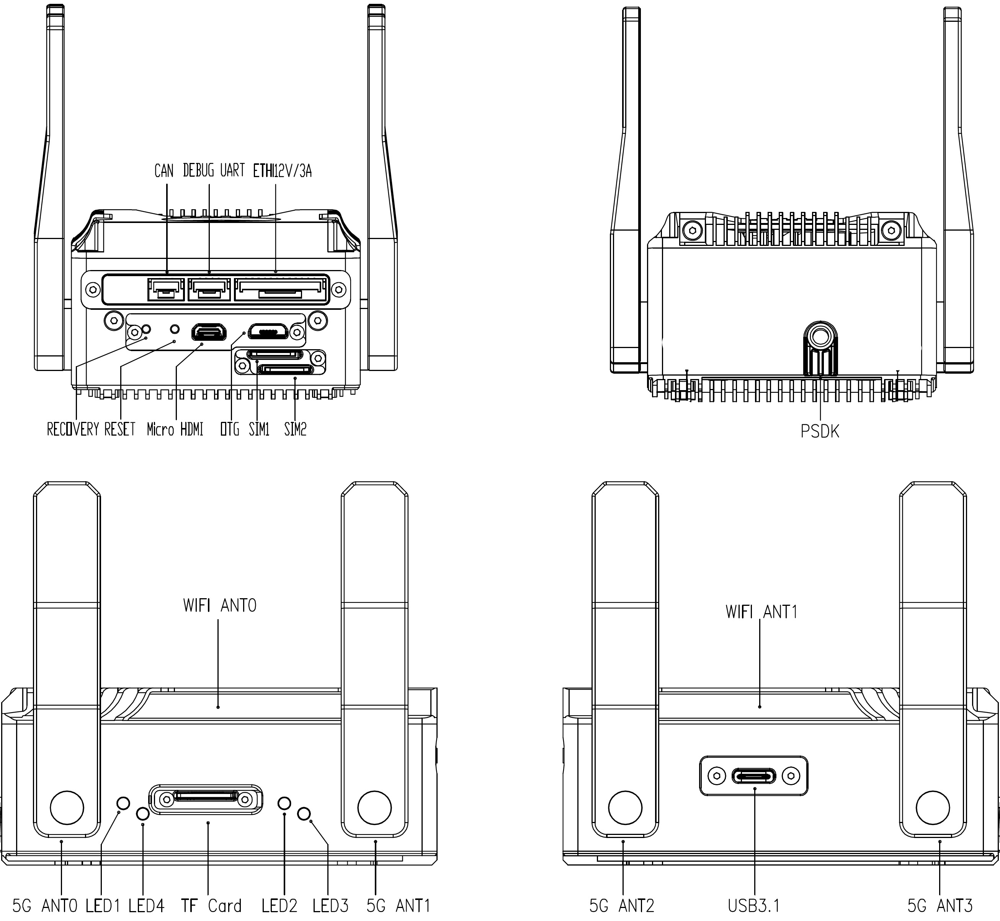

# Hardware Overview
## **AIRAI 3**
The illustrations below use the AIRAI3-NX-5G as an example. Unless otherwise specified, the descriptions apply to the both models in the AIRAI 3 series.

### **CAN Ports (GH1.25 3P)**

Pin map：

| Left |       | Right |
| ---- | ----- | ----- |
| 1    | 2     | 3     |
| GND  | CAN_L | CAN_H |

### **DEBUG UART Ports （GH1.25 4P）**

Pin map，baud rate is 115200.

| Left |              |              | Right         |
| ---- | ------------ | ------------ | ------------- |
| GND  | UART_RX      | UART_TX      | UART_VCC      |
|      | Default 3.3V | Default 3.3V | 3.3V~5V（NC） |

### **Ethernet Port & 12V output (GH1.25 12P)**

12V Maximum load current is 3A

| Left     |          |          |          |          |          |
| -------- | -------- | -------- | -------- | -------- | -------- |
| 1        | 2        | 3        | 4        | 5        | 6        |
| LAN_D1_P | LAN_D1_N | LAN_D2_P | LAN_D2_N | LAN_D3_P | LAN_D3_P |

|          |          |      |      |         | Right   |
| -------- | -------- | ---- | ---- | ------- | ------- |
|   7      | 8        | 9    | 10   | 11      | 12      |
| LAN_D4_P | LAN_D4_N | GND  | GND  | 12V_OUT | 12V_OUT |

### **RECOVERY Button**

Press it and power on AIRAI3 to enter Recovery mode. Refer to System Image for details.

> ⚠️Do not use a sharp needle to poke this button, otherwise it will be easily damaged; it is recommended to use the included screwdriver for button operation.

### **RESET Button**

Press once to reset the AIRAI 3。

> ⚠️Do not use a sharp needle to poke this button, otherwise it will be easily damaged; it is recommended to use the included screwdriver for button operation.

### **HDMI Output Port** 

Connect a display device.

### **OTG2.0（Micro USB）**

Use a Micro USB cable to connect AIRAI3 to the host PC for image backup and system recovery. Refer to System Image for details.

You can also log in to the system via SSH through this port.，Refer to Log in to the system via OTG2.0 cable for details.

### **SIM1、SIM2,LTE/5G Nano SIM card port**

Only the 5G version has SIM ports，AIRAI3-5G uses SIM1 by default。

Hot swapping is not supported, please insert the SIM card after powering off.

### **DJI E-PORT / PSDK / OSDK Port**

This port is called E-PORT for M350RTK、M3E/3T and M30/30T, and OSDK for M300RTK.

### **ANT0~ANT3 5G Antenna** 

> DO NOT block the antennas with metal objects.

### **Indicator LED1~4**

| LED  | Definitions                    | Normal Status | Remarks                                                      |
| ---- | ------------------------------ | ------------- | ------------------------------------------------------------ |
| LED1 | Power Indicator                | Always on     | The indicator is on when the AIRAI 3 is connected to a power source, and off whendisconnected. |
| LED2 | Working status indicator light | reserve       | Software definable                                           |
| LED3 | reserve                        | reserve       |                                                              |
| LED4 | 5G module Power Indicator      | Always on     |                                                              |

### **TF card port**

> ⚠️ Need to modify the system kernel device tree

### **USB3.1 port (Type-c)**

Use as a USB host. Connect external USB devices, such as mouse and keyboard.

the load capacity is 5V/3A;

Please use the included Type-c hub. Other brands of Type-c hub may not be able to use the network port due to compatibility issues.

### **Wi-Fi6 Antenna ANT0、ANT1**

The AIRAI3 series comes standard with a Wi-Fi communication module, which can be used for Internet connection or SSH debugging.

> DO NOT block the antennas with metal objects.

## **Function extension debugging module**
The interface expansion module is used to expand the AIRAI3 interface to facilitate development and debugging.
> ⚠️ The XT30 connector is used as a 12V power output, please do not input voltage, otherwise it will damage AIRAI3. 
> The 12V power supply output function is turned off by default and needs to be turned on by developers through commands.

