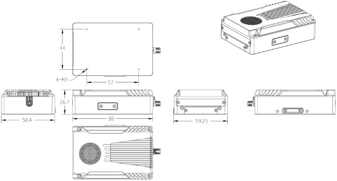

# Product overview

## Introduction
AirAI3 is a third-generation onboard computer specially built for drone developers, equipped with NVIDIA Jetson Xavier NX module.
It can complete complex graphics processing work more quickly, and also has 5G remote network connection and WIFI6 network connection functions. Built-in IcrestSDK can realize the rapid deployment of open source QGC ground stations to control DJI industry drones and AI models. The Icrest3 series provides a variety of interfaces to connect different external devices, apting to open source flight control systems such as DJI M3 Enterprise、M30 series、 M300RTK、M350RTK and PX4, etc.It has greater flexibility and scalability, while providing users with rich and convenient development channels.

## In The Box

## Software Pre-Installed
The AIRAI3 come with the following software pre-installed. Users can install other software according to different applications.

| Xavier Nano version | Xavier NX  version | Orin Nano version | Orin NX version |
| :-----------------: | :--------------------------: | :---------------: | :-------------: |
|    Ubuntu 18.04    |         Ubuntu 20.04         |   Ubuntu 20.04   |  Ubuntu 20.04  |
|     Jetpack 4.5     |        Jetpack 5.1.2        |  Jetpack 5.1.2  | Jetpack 5.1.2 |
|    cmake 3.10.2    |         cmake 3.16.3         |   cmake 3.16.3   |  cmake 3.16.3  |
|      gcc 7.5.0      |          gcc 9.4.0          |     gcc 9.4.0     |    gcc 9.4.0    |
|    CUDA 10.2.89    |        CUDA 11.4.315        |   CUDA 11.4.315   |  CUDA 11.4.315  |
|    OpenCV 4.5.1    |         Opencv 4.5.1         |   Opencv 4.5.1   |  Opencv 4.5.1  |
|     git 2.17.1     |          git 2.25.1          |    git 2.25.1    |   git 2.25.1   |
|    python 2.7.17    |         python 3.8.0         |   python 3.8.0   |  python 3.8.0  |

## Specifications

| Model      | AIRAI3-NX                                          | AIRAI3-NX-5G                                               | AIRAI3-Nano-5G                                             |
| --------------------- | -------------------------------------------------- | ---------------------------------------------------------- | ---------------------------------------------------------- |
| Weight                | 149g                                               | 236g                                                       | 226g                                                       |
| Dimensions            | 88x59x27mm                                         | 88x59x35.9mm（5G antenna not included）                    | 88x59x35.9mm（5G antenna not included）                    |
| Processor             | NVIDIA Jetson Xavier NX                            | NVIDIA Jetson Xavier NX                                    | NVIDIA Jetson Xavier Nano                                  |
| AI performance        | 21 TOPS                                            | 472 GFLOPS                                                 | 21 TOPS                                                    |
| Memory                | 8GB 128-bit LPDDR4x @ 1600MHz\|51.2GB/s            | 8GB 128-bit LPDDR4x @ 1600MHz\|51.2GB/s                    | 4 GB 64 bit LPDDR4 @1600 MHz\|25.6GB/s                     |
| SSD                   | 128GB                                              | 128GB                                                      | 128GB                                                      |
| TF card storage       | √                                                 | √                                                         | √                                                         |
| Network               | ● Gigabit Ethernet with GH1.25 interface ● WIFI6 | ● 5G NR ● Gigabit Ethernet with GH1.25 interface● WIFI6 | ● 5G NR ● Gigabit Ethernet with GH1.25 interface● WIFI6 |
| SIM card              | /                                                  | Nano SIM x 2                                               | Nano SIM x 2                                               |
| USB                   | USB 3.1 (10Gbps) + USB 2.0 x 3                     | USB 3.1 (10Gbps) + USB 2.0 x 3                             | USB 3.1 (10Gbps) + USB 2.0 x 3                             |
| Display interface     | Micro HDMI                                         | Micro HDMI                                                 | Micro HDMI                                                 |
| I/O                   | UART port × 2、CAN port x 1                       | UART port × 2、CAN port x 1                               | UART port × 2、CAN port x 1                               |
| Power                 | 5-25 W                                             | 5-10 W                                                     | 5-25 W                                                     |
| Power supply          | 12 - 48 V power port ×1                           | 12 - 48 V power port ×1                                   | 12 - 48 V power port ×1                                   |
| Power output          | 12V/3A                                             | 12V/3A                                                     | 12V/3A                                                     |
| Operating Temperature | -25 ~80℃                                          | -25 ~80℃                                                  | -25 ~80℃                                                  |
| IP rate               | IPX5                                               | IPX5                                                       | IPX5                                                       |

## Dimensions

